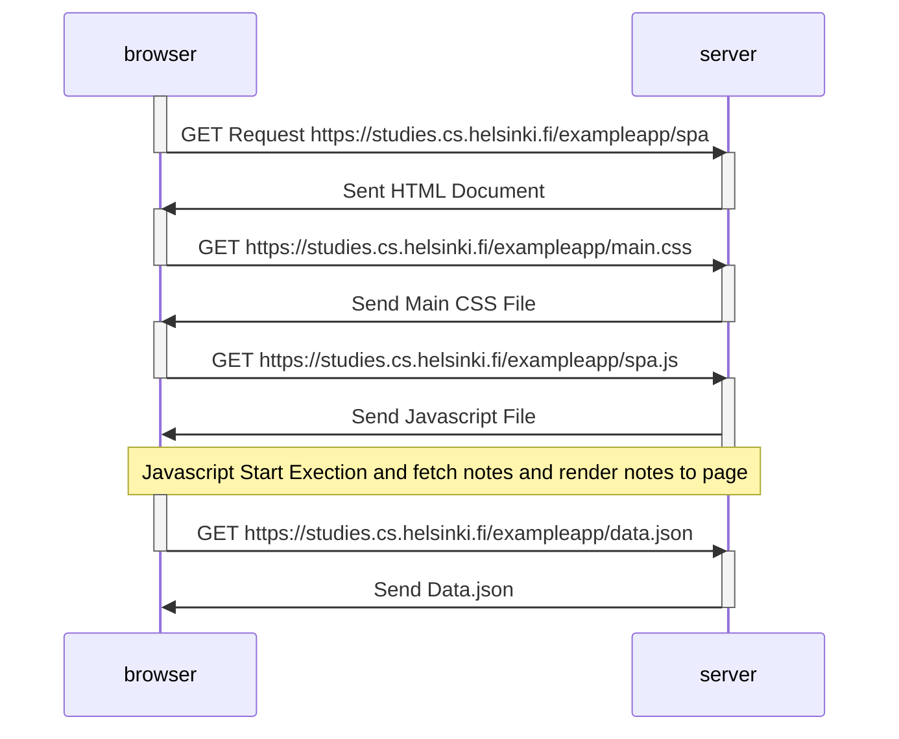

```mermaid
sequenceDiagram;
participant browser;
participant server;
activate browser;
browser->>server: GET Request https://studies.cs.helsinki.fi/exampleapp/spa;
deactivate browser;
activate server;
server->>browser: Sent HTML Document;
deactivate server;
activate browser;
browser->>server: GET https://studies.cs.helsinki.fi/exampleapp/main.css;
deactivate browser;
activate server;
server->>browser: Send Main CSS File;
deactivate server;
activate browser;
browser->>server: GET https://studies.cs.helsinki.fi/exampleapp/spa.js;;
deactivate browser;
activate server;
server->>browser: Send Javascript File;
Note over server,browser: Javascript Start Exection and fetch notes and render notes to page;
deactivate server;
activate browser;
browser->>server: GET https://studies.cs.helsinki.fi/exampleapp/data.json;
deactivate browser;
activate server;
server->>browser: Send Data.json;
deactivate server;
```
