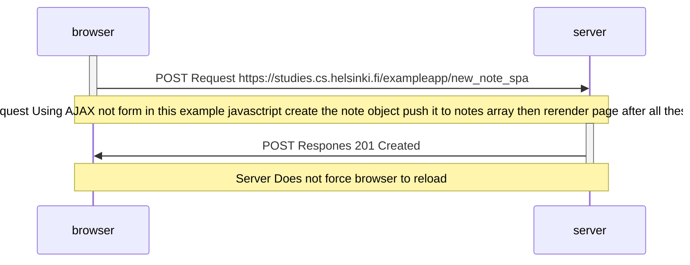

```mermaid
sequenceDiagram;
participant browser;
participant server;
activate browser;
browser->>server: POST Request https://studies.cs.helsinki.fi/exampleapp/new_note_spa;
Note over browser,server: Javascript Send the POST Request Using AJAX not form in this example javasctript create the note object push it to notes array then rerender page after all these it send it to server to save it
deactivate browser;
activate server;
server->>browser: POST Respones 201 Created;
Note over server,browser: Server Does not force browser to reload
deactivate server;
```
