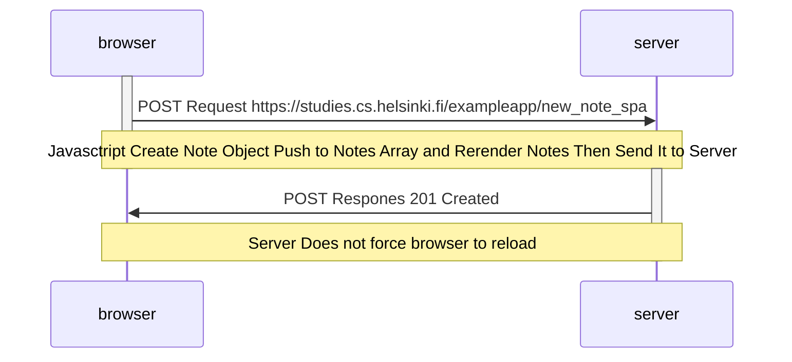

```mermaid
sequenceDiagram;
participant browser;
participant server;
activate browser;
browser->>server: POST Request https://studies.cs.helsinki.fi/exampleapp/new_note_spa;
Note over browser,server: Javasctript Create Note Object Push to Notes Array and Rerender Notes Then Send It to Server
deactivate browser;
activate server;
server->>browser: POST Respones 201 Created;
Note over server,browser: Server Does not force browser to reload
deactivate server;
```
